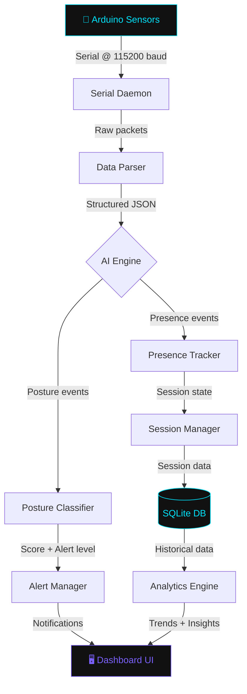

<div align="center">

<!-- ANIMATED HEADER -->
<a href="https://github.com/your-username/NeuroDesk">
  
</a>

<br/>

<!-- SUBTITLE ANIMATION -->
<a href="https://github.com/your-username/NeuroDesk">
  
</a>

<br/><br/>

<!-- ANIMATED DIVIDER -->


<br/>

<!-- CORE BADGES ROW 1 -->


<br/>

<!-- CORE BADGES ROW 2 -->


<br/>

<!-- STATUS BADGES -->


<br/><br/>

<!-- ANIMATED WAVE BANNER -->


</div>

---

## 📋 Table of Contents

<div align="center">

| Section | Description |
|:-------:|:-----------:|
| [🌌 Overview](#-overview) | Project philosophy & vision |
| [✨ Features](#-key-features) | Full feature breakdown |
| [🏗️ Architecture](#%EF%B8%8F-system-architecture) | System design & data flow |
| [🔩 Hardware](#-hardware-layer) | Components & schematics |
| [🧠 AI Engine](#-ai-engine--intelligence-layer) | ML models & algorithms |
| [📊 Dashboard](#-dashboard--ui) | Interface overview |
| [🚀 Setup](#-installation--setup) | Step-by-step installation |
| [⚙️ Configuration](#%EF%B8%8F-configuration) | Config file reference |
| [📈 Roadmap](#-roadmap) | Planned features |
| [🤝 Contributing](#-contributing) | How to contribute |

</div>

---

## 🌌 Overview

<div align="center">

</div>

<br/>

**NeuroDesk** is not just a productivity tool — it's a **proactive ergonomic intelligence system** that sits at the intersection of embedded hardware and machine learning. Built for students, developers, and knowledge workers who spend long hours at a desk, NeuroDesk continuously monitors your physical posture and mental presence, giving you real-time feedback before fatigue or injury sets in.

Unlike passive timers or reminders, NeuroDesk uses a **sensor array connected to an Arduino microcontroller** that feeds live data into Python-powered AI algorithms. These algorithms don't just react — they learn from your habits, adapting thresholds and alert intervals to your unique workflow.

> *"Most people only notice bad posture when their back already hurts. NeuroDesk catches it in the first 10 seconds."*

### Why NeuroDesk?

| Problem | NeuroDesk Solution |
|:--------|:-------------------|
| 🪑 Chronic slouching & back pain | Sensor-based real-time spinal alignment detection |
| 😴 Unnoticed distraction & absence | Ultrasonic presence tracking with deep-work scoring |
| 📊 No data on study habits | Historical session logging with AI-generated insights |
| 🌙 Eye strain from bright UIs | Pitch-black AMOLED dashboard with neon accents |
| ⏳ Forgetting to take breaks | Adaptive break suggestions using Pomodoro-variant AI |

---

## ✨ Key Features

<div align="center">

</div>

<br/>

### 🩻 Real-Time Posture Tracking
> Sensor arrays measure the distance between your body and the desk at multiple reference points. Deviation from calibrated "good posture" baselines triggers graduated alerts — a soft glow first, then an audio chime, then a full-screen overlay if ignored.

- **Tolerance zones** configurable per user
- **Slouch angle estimation** via multi-sensor triangulation
- **Session posture score** (0–100) logged every 5 minutes

---

### ⏱️ Presence & Productivity Monitoring
> NeuroDesk knows when you're there — and when you're not. Ultrasonic sensors detect your presence at the desk, and the AI engine computes a **Deep Work Score** based on continuous uninterrupted presence intervals.

- Distinguishes between **"at desk"** vs **"working at desk"** states
- Logs idle time, break time, and productive time separately
- Exports session summaries as `.json` and `.csv`

---

### 🧠 AI-Driven Insights
> Every evening, NeuroDesk generates a personalized report using your historical posture and presence data. The AI identifies patterns — your most productive hour, your worst slouching window, how your posture degrades over a 3-hour session.

- Powered by **scikit-learn** regression and clustering models
- Generates natural-language summaries of your performance
- Compares week-over-week trends for habit building

---

### ⚡ Hardware-Software Synergy
> Data flows from physical sensors through serial communication at **115200 baud**, parsed by a Python daemon that runs as a background service. Latency from sensor detection to dashboard update: **< 80ms**.

- Arduino handles all real-time sensor I/O
- Python backend processes, stores, and visualizes
- Clean separation of concerns: firmware stays lean, AI stays rich

---

### 🌑 Dark Luxury Dashboard
> Built with Tkinter enhanced by custom canvas rendering, the NeuroDesk UI is a pitch-black environment with neon cyan and violet accents. No whites, no grays — just pure AMOLED aesthetic for zero eye strain.

- Animated circular progress rings for posture score
- Live graph of presence data (rolling 30-minute window)
- Notification panel with timestamped alert history

---

### 🔔 Graduated Alert System
> Alerts escalate gracefully. You won't be jarred by an alarm the moment you lean slightly — NeuroDesk gives you time to self-correct before escalating.

| Level | Trigger | Alert Type |
|:-----:|:--------|:-----------|
| 1 | 10s poor posture | Dashboard highlight turns amber |
| 2 | 30s poor posture | Soft audio chime |
| 3 | 60s poor posture | Desktop notification popup |
| 4 | 90s poor posture | Full-screen overlay (dismissible) |

---

### 📦 Session Management
> Every study or work session is a first-class object in NeuroDesk. Start, pause, resume, and end sessions with a single click. All sessions are archived with full posture and presence timelines.

---

### 📈 Historical Analytics
> A dedicated Analytics view shows weekly and monthly trends. Charts are rendered using **Matplotlib** embedded directly in the Tkinter canvas — no browser required.

---

### 🔧 Self-Calibrating Baselines
> On first launch, NeuroDesk walks you through a 30-second calibration — sit up straight, face forward — and records your personalized neutral baselines. These baselines adapt over time as your ergonomic preferences evolve.

---

### 🌐 Optional Cloud Sync *(Planned)*
> Export your session data to a cloud endpoint for multi-device access and long-term trend analysis.

---

## 🏗️ System Architecture

<div align="center">

</div>

<br/>

```
┌─────────────────────────────────────────────────────────────────────┐
│                         NeuroDesk System                            │
│                                                                     │
│  ┌─────────────────────┐        ┌──────────────────────────────┐   │
│  │   HARDWARE LAYER    │        │       SOFTWARE LAYER         │   │
│  │                     │        │                              │   │
│  │  [Ultrasonic x2]    │        │  ┌────────────────────────┐  │   │
│  │  [IR Sensor x1]  ───┼──USB──►│  │  Serial Daemon (Python)│  │   │
│  │  [Arduino Uno]      │        │  └──────────┬─────────────┘  │   │
│  │  [Buzzer]           │        │             │ parsed data     │   │
│  └─────────────────────┘        │  ┌──────────▼─────────────┐  │   │
│                                 │  │   Core AI Engine        │  │   │
│                                 │  │  - Posture Classifier   │  │   │
│                                 │  │  - Presence Detector    │  │   │
│                                 │  │  - Session Analyzer     │  │   │
│                                 │  └──────────┬─────────────┘  │   │
│                                 │             │ events + scores │   │
│                                 │  ┌──────────▼─────────────┐  │   │
│                                 │  │  SQLite Database        │  │   │
│                                 │  │  (sessions, logs, cfg)  │  │   │
│                                 │  └──────────┬─────────────┘  │   │
│                                 │             │                 │   │
│                                 │  ┌──────────▼─────────────┐  │   │
│                                 │  │  Dashboard (Tkinter)    │  │   │
│                                 │  │  - Live Posture Ring    │  │   │
│                                 │  │  - Presence Timeline    │  │   │
│                                 │  │  - Alert Manager        │  │   │
│                                 │  │  - Analytics View       │  │   │
│                                 │  └────────────────────────┘  │   │
│                                 └──────────────────────────────┘   │
└─────────────────────────────────────────────────────────────────────┘
```

### 🔄 Data Flow



---

## 🔩 Hardware Layer

<div align="center">

### Bill of Materials

| Component | Model | Quantity | Purpose |
|:----------|:------|:--------:|:--------|
| Microcontroller | Arduino Uno R3 | 1 | Central sensor hub |
| Distance Sensor | HC-SR04 Ultrasonic | 2 | Posture + Presence detection |
| Motion Sensor | PIR HC-SR501 | 1 | Secondary presence validation |
| Active Buzzer | 5V Active Buzzer | 1 | Level-2 audio alert |
| LED Strip | WS2812B (5 LEDs) | 1 | Level-1 visual alert |
| USB Cable | USB-A to USB-B | 1 | Power + Serial communication |
| Breadboard | Full-size 830pt | 1 | Prototyping |
| Resistors | 220Ω, 10kΩ | Assorted | Circuit protection |
| Jumper Wires | M-M, M-F | 30+ | Connections |

</div>

### 📐 Sensor Placement Guide

```
                    [Monitor]
                       ▲
                       │  ~50-70cm
                    [YOU]
                    /   \
                   /     \
     [Sensor A]──────────────[Sensor B]
    (Left shoulder        (Right shoulder
      reference)            reference)

  Sensor A = Ultrasonic #1 → detects left-side distance
  Sensor B = Ultrasonic #2 → detects right-side distance
  Delta between A & B → lateral tilt detection
  Average of A & B vs baseline → forward slouch detection
```

### ⚡ Arduino Pin Mapping

```cpp
// Sensor 1 (Left - Posture)
#define TRIG_1  2
#define ECHO_1  3

// Sensor 2 (Right - Posture)  
#define TRIG_2  4
#define ECHO_2  5

// PIR Presence Sensor
#define PIR_PIN 6

// Buzzer
#define BUZZ_PIN 8

// Status LED
#define LED_PIN  9
```

---

## 🧠 AI Engine & Intelligence Layer

### Posture Classification Model

NeuroDesk uses a **multi-threshold classifier** trained on reference posture data:

```python
class PostureClassifier:
    STATES = {
        "EXCELLENT": (0, 2),      # ±2cm from baseline
        "GOOD":      (2, 4),      # ±2–4cm
        "WARNING":   (4, 7),      # ±4–7cm
        "POOR":      (7, 12),     # ±7–12cm
        "CRITICAL":  (12, float('inf'))  # >12cm
    }

    def classify(self, left_dist, right_dist, baseline):
        deviation = self._compute_deviation(left_dist, right_dist, baseline)
        lateral_tilt = abs(left_dist - right_dist)
        return self._map_to_state(deviation, lateral_tilt)
```

### Session Scoring Algorithm

Each session receives a **Neuro Score™** computed as:

```
Neuro Score = (
    (posture_score   × 0.40) +
    (presence_ratio  × 0.30) +
    (break_quality   × 0.20) +
    (focus_streak    × 0.10)
) × 100
```

Where:
- **posture_score** = % of session time in GOOD or EXCELLENT state
- **presence_ratio** = presence time / total session time
- **break_quality** = adherence to recommended break schedule
- **focus_streak** = longest uninterrupted EXCELLENT posture window (normalized)

---

## 📊 Dashboard & UI

### Interface Panels

```
┌─────────────────────────────────────────────────┐
│  ◉ NeuroDesk v1.0          [Session: 01:23:47]  │
├────────────┬──────────────────┬─────────────────┤
│            │   POSTURE RING   │  TODAY'S SCORE  │
│  PRESENCE  │                  │                 │
│  TIMELINE  │    ┌──────┐      │   ◉  78 / 100  │
│            │   ╱  87%  ╲     │   Neuro Score™  │
│  ████░░░░  │  │  GOOD  │     │                 │
│  ██████░░  │   ╲______╱     │  ↑ +5 vs. Mon   │
│  ████████  │                  │                 │
│            │   [CALIBRATE]    │  Best Hour: 3pm │
├────────────┴──────────────────┴─────────────────┤
│  ALERTS   ► 14:32 — Slouch detected (Level 2)   │
│           ► 13:15 — Break recommended            │
│           ► 11:00 — Session started              │
└─────────────────────────────────────────────────┘
```

---

## 🚀 Installation & Setup

<div align="center">

</div>

### Prerequisites


### Step 1 — Clone the Repository

```bash
git clone https://github.com/yourusername/NeuroDesk.git
cd NeuroDesk
```

### Step 2 — Install Python Dependencies

```bash
# Create a virtual environment (recommended)
python -m venv neurodesk-env
source neurodesk-env/bin/activate  # On Windows: neurodesk-env\Scripts\activate

# Install all dependencies
pip install -r requirements.txt
```

**`requirements.txt` includes:**
```
pyserial==3.5
scikit-learn==1.3.0
numpy==1.24.3
matplotlib==3.7.2
pandas==2.0.3
playsound==1.3.0
sqlite3  # (built-in)
tkinter  # (built-in)
```

### Step 3 — Flash Arduino Firmware

1. Open **Arduino IDE 2.x**
2. Open `hardware/firmware/neurodesk_sensors.ino`
3. Select **Board:** `Arduino Uno`
4. Select the correct **Port** (e.g., `COM3` on Windows, `/dev/ttyUSB0` on Linux)
5. Click **Upload** ⬆️

### Step 4 — Hardware Assembly

```
Follow the wiring guide in /hardware/schematics/wiring_diagram.pdf
Recommended mounting positions in /hardware/schematics/placement_guide.pdf
```

### Step 5 — Configure

```bash
cp config/config.example.toml config/config.toml
nano config/config.toml  # Set your COM port + preferences
```

### Step 6 — Calibrate & Launch

```bash
# Run initial calibration (30 seconds, sit up straight!)
python calibrate.py

# Launch the full dashboard
python main.py
```

---

## ⚙️ Configuration

Full reference for `config/config.toml`:

```toml
[hardware]
port = "COM3"           # Serial port (COM3 / /dev/ttyUSB0)
baud_rate = 115200      # Must match Arduino firmware
sensor_poll_hz = 10     # Readings per second

[posture]
calibration_file = "data/baseline.json"
warning_threshold_cm = 4.0    # Deviation before WARNING state
alert_threshold_cm = 7.0      # Deviation before POOR state
alert_delay_seconds = 30      # Grace period before escalating alerts

[session]
auto_start = false            # Auto-start session on desk presence
min_session_minutes = 5       # Ignore sessions shorter than this
break_interval_minutes = 50   # Recommended break interval (Pomodoro)
break_duration_minutes = 10   # Recommended break duration

[ui]
theme = "amoled_dark"         # amoled_dark | dark | light
accent_color = "#00E5FF"      # Primary accent color
secondary_color = "#7B61FF"   # Secondary accent
dashboard_refresh_ms = 500    # UI refresh interval

[alerts]
audio_enabled = true
desktop_notifications = true
buzzer_enabled = true         # Requires hardware buzzer
overlay_enabled = true        # Full-screen overlay at Level 4

[analytics]
export_format = ["json", "csv"]
auto_export_daily = true
export_path = "data/exports/"
```

---

## 📁 Project Structure

```
NeuroDesk/
│
├── 📁 hardware/
│   ├── 📁 firmware/
│   │   └── neurodesk_sensors.ino       # Arduino C++ firmware
│   └── 📁 schematics/
│       ├── wiring_diagram.pdf
│       └── placement_guide.pdf
│
├── 📁 src/
│   ├── serial_daemon.py                # Serial port listener & parser
│   ├── posture_classifier.py           # AI posture state classifier
│   ├── presence_tracker.py             # Desk presence logic
│   ├── session_manager.py              # Session lifecycle management
│   ├── alert_manager.py                # Graduated alert dispatcher
│   ├── analytics_engine.py             # Historical trend analysis
│   └── database.py                     # SQLite ORM layer
│
├── 📁 ui/
│   ├── dashboard.py                    # Main Tkinter dashboard
│   ├── analytics_view.py               # Charts & historical view
│   ├── calibration_wizard.py           # First-run calibration UI
│   └── 📁 assets/
│       ├── sounds/
│       └── icons/
│
├── 📁 config/
│   ├── config.toml                     # User configuration
│   └── config.example.toml             # Template
│
├── 📁 data/
│   ├── baseline.json                   # Calibration baselines
│   ├── sessions.db                     # SQLite database
│   └── 📁 exports/                     # CSV / JSON session exports
│
├── main.py                             # Entry point
├── calibrate.py                        # Standalone calibration runner
├── requirements.txt
├── LICENSE
└── README.md
```

---

## 📈 Roadmap

<div align="center">

| Quarter | Feature | Status |
|:-------:|:--------|:------:|
| Q1 2025 | Core sensor integration + serial daemon | ✅ Done |
| Q1 2025 | Posture classifier (threshold-based) | ✅ Done |
| Q2 2025 | Dashboard v1 (Tkinter AMOLED) | ✅ Done |
| Q2 2025 | Session management + SQLite logging | ✅ Done |
| Q3 2025 | ML-based posture model (scikit-learn) | 🔄 In Progress |
| Q3 2025 | Analytics view + weekly reports | 🔄 In Progress |
| Q4 2025 | Cloud sync (optional REST API) | 📋 Planned |
| Q4 2025 | Mobile companion app (React Native) | 📋 Planned |
| 2026 | Computer vision posture via webcam (OpenCV) | 💡 Research |
| 2026 | LLM-powered daily coaching summaries | 💡 Research |

</div>

---

## 🤝 Contributing

Contributions are welcome! Please follow these steps:

1. **Fork** the repository
2. Create a feature branch: `git checkout -b feature/AmazingFeature`
3. Commit your changes: `git commit -m 'feat: Add AmazingFeature'`
4. Push to the branch: `git push origin feature/AmazingFeature`
5. Open a **Pull Request**

Please read `CONTRIBUTING.md` for detailed coding standards and PR guidelines.

---

## 📄 License

Distributed under the **MIT License**. See `LICENSE` for more information.

---

<div align="center">


<br/>

<!-- FOOTER TYPING ANIMATION -->


<br/><br/>

[](https://github.com/yourusername)
[](https://yourportfolio.dev)
[](https://linkedin.com/in/yourusername)

<br/>

<!-- WAVE FOOTER -->


<br/>

*⭐ Star this repo if NeuroDesk helped you sit straighter today.*

</div>
